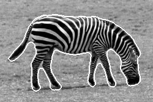
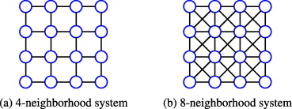
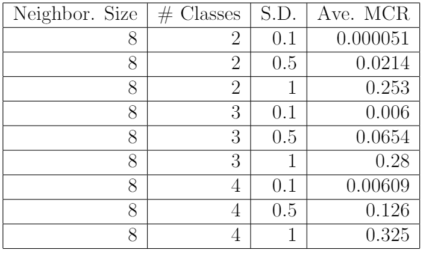
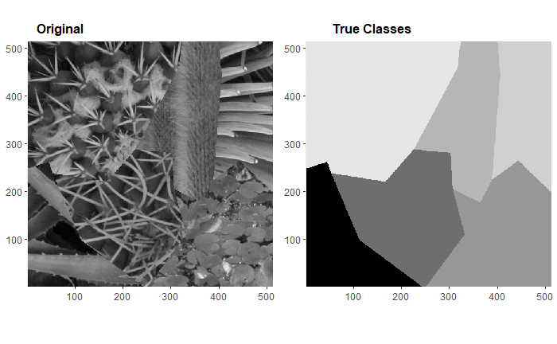
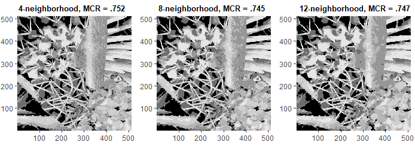
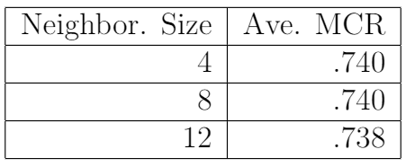
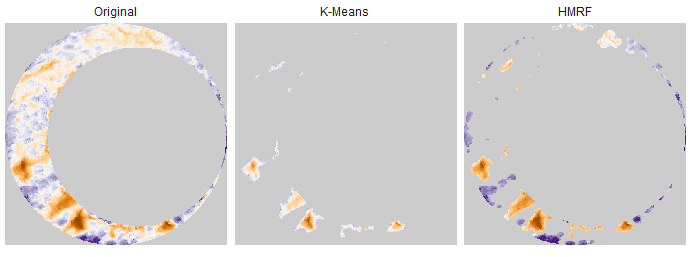

```{r setup, include=FALSE}
options(htmltools.dir.version = FALSE)
set.seed(11242020)
```

```{r, load_refs, include=FALSE, cache=FALSE}
RefManageR::BibOptions(check.entries = FALSE,
                       bib.style = "authoryear",
                       cite.style = "alphabetic",
                       style = "markdown",
                       max.names = 1,
                       no.print.fields = c("urldate","file","issn","url","keywords","language","abstract"),
                       hyperlink = FALSE,
                       dashed = FALSE)
myBib <- RefManageR::ReadBib("ref.bib", check = FALSE)
```

# Outline

- Introduction

- Hidden Markov Random Field Model
 
 - Finite Normal Mixture Model
 
 - Markov Random Field Model
 
 - Hidden Markov Random Field Model

- Model Fitting

- Simulations & Examples

---
class: inverse, center, middle

# Introduction

---

# Motivation

- *Texture*: image feature that quantifies the spatial arrangement of pixel intensities.

- *Texture segmentation*: process of classifying regions in an image with common textures.

  - Often a critical first step of an image processing procedure.

.pull-left[
```{r echo=FALSE}

```
]
.pull-right[
```{r echo=FALSE}
knitr::include_graphics("images/houseSegmentation.png")
```
]

---
class: inverse, middle, center

# Hidden Markov Random Field Model

---

# Finite Normal Mixture Model

Suppose a random variable $Y$ has density

$$
f(y) = \sum_{g=1}^G \pi_g f(y ; \mu_g, \sigma_g^2)
$$

where $\pi_g \in (0,1), \sum_{g=1}^G \pi_g = 1$, and $f(y;\mu_g, \sigma_g^2)$ is $N(\mu_g, \sigma_g^2)$ density.

--

This can be explained by introducing a latent variable $Z \in \{1,...,G\}$ such that

$$
f(y) = \sum_{g=1}^G P(Z = g) f(y | Z = g).
$$

--

Then for $i = 1,...,n$, the joint density of $(z_i, y_i)$, is

$$
\prod_{g = 1}^G \left\[\pi_g f(y_i | z_i = g)\right\]^{I(z_i = g)}.
$$

---
# FNM Model Discussion

- Estimation of $\{(\mu_g, \sigma_g^2, \pi_g) : g = 1,...,G\}$ by EM algorithm is relatively straightforward for FNM model.

- Can behave as if $P(Z_i = g)$ is the probability that pixel $i$ is of texture $g$.

 - Then assume observed pixel intensity $Y_i | Z_i = g$ is $N(\mu_g, \sigma_g^2)$.

--

- **Problem:** we assume $(Z_i, Y_i)$ independent of $(Z_j, Y_j)$ for $i \neq j$.

 - A pixel's texture label *should be* related to that of its neighbors.
 
 - Basic FNM model does not capture desired local pixel associations.
 
 - Will assume a conditional structure on $P(Z_i = g)$.

---

# Random Fields & Neighborhoods

- Let $\mathcal{S} = \{1,...,n\}$.

- A collection of random variables $\pmb{R} = \{R_i : i \in \mathcal{S}\}$ is called a (discrete index) *random field*.

 - $i$ refers to a "site" of the random field.

--

- $N_i \subset \mathcal{S}$ is a *neighborhood* of site $i$ if

 1. $i \not\in N_i$
 
 2. $i \in N_j \iff j \in N_i$


```{r echo=FALSE,fig.align='center',out.width=400}

```

---
# Markov Random Fields


- A random field $\pmb{R}$ is a *Markov Random Field* with respect to $\mathcal{N} = \{N_i : i \in \mathcal{S}\}$ if

 1. $P(\pmb{R} = \pmb{r}) > 0, \forall \pmb{r} \in \mathcal{R}$ where $\mathcal{R}$ is state space of $\pmb{R}$
 
 2. $P(R_i = r_i| R_{\mathcal{S} \setminus i}) = P(R_i = r_i| R_{N_i})$

$\hspace{.35in}$ where $R_{\mathcal{S} \setminus i} \equiv \{R_j : j \in \mathcal{S}, j \neq i\}$ and $R_{N_i} \equiv \{R_j : j \in N_i\}$.

--

- We will model texture labels as a MRF.

 - Assume that each pixel is described by one of a finite set of textures.

---
# Distribution of MRF

- **Hammersly-Clifford (1971)**: any MRF $\pmb{R}$ can be characterized by a Gibbs distribution with appropriately-defined energy function (and vice-versa). 

- $R_i$ following a Gibbs distribution means for some *energy function* $U$,

$$P\left(\pmb{R} = \pmb{r}\right) \propto \exp\left[-U(\pmb{r})\right]$$

--

- In statistical mechanics, $U$ describes the energy in configuration $\pmb{r}$ of $\pmb{R}$.

- For our purposes, $U$ will penalize neighboring pixels with different texture labels.

---
# Energy Function Assumptions

- Define a *clique* $c \subset \mathcal{S}$ such that $i,j \in c, i \neq j \implies i$ and $j$ are neighbors.

 - E.g., maximum clique size of 2 for 4-neighborhood structure.

- Define $\mathcal{C}$ to be set of all possible cliques.

--

- Assume $U(\pmb{r})$ has the form

$$
U(\pmb{r}) = \sum_{c \in \mathcal{C}} V_c(\pmb{r}).
$$

- $V_c(\pmb{r})$ is a *clique potential*.

 - Reduces to $V_c(r_i,r_j)$, $i,j \in \mathcal{S}$, for 4-neighbor structure.

 - E.g., $V_c(r_i, r_j) = \alpha I(r_i \neq r_j)$ for $\alpha > 0$.

---
# Hidden MRF Model - Zhang et al. (2001)

Model assumptions are:

1. Texture labels $\pmb{Z} = \{Z_i : i \in \mathcal{S}\}$ are "Hidden" MRF with finite state space $\mathcal{G}$.

--

2. Observed pixel intensities $\pmb{Y} = \{Y_i : i \in \mathcal{S}\}$ are random field with finite state space $\mathcal{Y}$

 - Assume conditional distribution of $Y_i | Z_i = g$ has density $f(y_i ; \pmb{\theta}_{g})$ of known functional form with parameters $\pmb{\theta}_{g}$.

--

3. Assume $\pmb{Y}$ are conditionally independent given $\pmb{Z} = \pmb{g}$ meaning

$$
f(\pmb{y} | \pmb{z}) = \prod_{i \in \mathcal{S}} f(y_i ; \pmb{\theta}_g).
$$

Then the joint density is given by

$$
f(\pmb{y}, \pmb{z}) = P(\pmb{Z} = \pmb{g}) \prod_{i \in \mathcal{S}} f(y_i | \pmb{\theta}_g).
$$

---
# Hidden MRF Model - Zhang et al. (2001)

- Note that for $i \in \mathcal{S}$, we can express the conditional density of $y_i$ given the neighbors of $z_i$ as

$$f(y_i | z_{N_i};\pmb{\theta}) = \sum_{g=1}^G f(y_i ; \pmb{\theta}_g) P(Z_i = g | z_{N_i}).$$
- This is referred to as the Hidden Markov Random Field model.

```{r, echo=FALSE,out.width = 175,fig.align='center'}
knitr::include_graphics("images/mrf_diagram.jpg")
```

--

- Assuming $f(y_i;\pmb{\theta}_g)$ Normal, $\pmb{\theta}_g$ is estimated similar to FNM model EM estimation.

- $P(Z_i = g | \{z_j : j \in N_i\})$ requires alternative estimation.

---
class: inverse, middle, center

# Model Fitting

---

# EM Algorithm

E-Step involves computing

$$
Q\left(\pmb{\theta} | \pmb{\theta}^{(t)}\right) = \sum_{\pmb{g} \in \mathcal{G}} \log\left(f\left(\pmb{y}, \pmb{g} ; \pmb{\theta}^{(t)}\right)\right) P\left(\pmb{g} | \pmb{y};\pmb{\theta}^{(t)}\right).
$$

--

The M-step results in

$$\mu_g^{(t+1)} = \frac{\sum_{i \in \mathcal{S}} P(Z_i = g  | * ) y_i}{\sum_{i \in \mathcal{S}} P(Z_i = g | *)}$$
$$\sigma_g^{2^{(t+1)}} = \frac{\sum_{i \in \mathcal{S}} P(Z_i = g | *)\left(y_i - \mu_g^{(t)}\right)^2}{\sum_{i \in \mathcal{S}} P(Z_i = g |*)}$$

where $P(Z_i = g | *)$ is short for

$$P(Z_i = g | y_i, z_{N_i}; \pmb{\theta}^{(t)}) = \frac{f\left(y_i ; \pmb{\theta}_g^{(t)}\right) P(Z_i = g | z_{N_i})}{\sum_{g=1}^G f\left(y_i ; \pmb{\theta}_g^{(t)}\right) P(Z_i = g | z_{N_i})}.$$

---

# Class Label MAP Estimation

- $P(Z_i = g | z_{N_i})$ requires estimation of class labels based on $\pmb{\theta}^{(t)}$.

- Zhang et  al. (2001), by way of Besag (1986), use maximum a posteriori (MAP) estimation:

$$\hat{\pmb{g}} = \arg \max_{\pmb{g} \in \mathcal{G}} P(\pmb{Z} = \pmb{g} | \pmb{y}) = \arg\max_{\pmb{g} \in \mathcal{G}} f(\pmb{y} | \pmb{g}) P(\pmb{Z} = \pmb{g}).$$

--

- $f(\pmb{y} | \pmb{g})$ is joint normal likelihood and $P(\pmb{Z} = \pmb{g})$ is a Gibbs distribution.

- The optimization problem reduces to:

$$\hat{\pmb{g}} = \arg \min_{\pmb{g} \in \mathcal{G}} \left(\sum_{i \in \mathcal{S}} \left[\frac{(y_i - \mu_{z_i})^2}{2 \sigma_{z_i}^2} + \log(\sigma_{z_i})\right] + U(\pmb{g})\right).$$

--

- Assume $V_c(z_i, z_j) = \frac{1}{2} I(z_i \neq z_j)$ (Potts Model).

- Use an Iterated Conditional Modes algorithm to find $\hat{\pmb{g}}$.

---
class: inverse, middle, center

# Simulations & Examples

---
# Simulation Study #1

- Vary number of classes, observed noise, neighborhood size.

- Use misclassification rate (proportion of misclassified pixels) as diagnostic.

- Simulate 100 images from MRF of size 100x100 for each \# of classes, noise, and neighborhood size combination.

---
## Simulation Study #1: 4-Neighborhood Examples

```{r, echo=FALSE,fig.align='center'}
library(ggplot2)
library(mrf2d)

th_2class <- expand_array(-1, family = "onepar", mrfi(1,norm_type = "1"), C = 2 - 1)
th_4class <- expand_array(-1, family = "onepar", mrfi(1,norm_type = "1"), C = 4 - 1)

sim_2class <- rmrf2d(init_Z = c(100,100),mrfi = mrfi(1,norm_type = "1"),theta = th_2class)
sim_2class2 <- rmrf2d(init_Z = c(100,100),mrfi = mrfi(1,norm_type = "1"),theta = th_2class)
sim_4class <- rmrf2d(init_Z = c(100,100),mrfi = mrfi(1,norm_type = "1"),theta = th_4class)

obs_2class_sd.1 <- sim_2class + rnorm(100^2,sd = .1)

obs_2class_sd1 <- sim_2class2 + rnorm(100^2,sd = 1)

obs_4class_sd.1 <- sim_4class + rnorm(100^2,sd = .1)

plt1 <- cplot(obs_2class_sd.1,legend = FALSE) + coord_fixed() + ggtitle("2 classes, s.d. = 0.1")
plt2 <- cplot(obs_2class_sd1,legend = FALSE) + coord_fixed() + ggtitle("2 classes, s.d. = 1")
plt3 <- cplot(obs_4class_sd.1,legend = FALSE) + coord_fixed() + ggtitle("4 classes, s.d. = 0.1")

fit_2class_sd.1 <- fit_ghm(obs_2class_sd.1,mrfi = mrfi(1,norm_type = "1"),theta = th_2class,verbose = FALSE)
fit_2class_sd1 <- fit_ghm(obs_2class_sd1,mrfi = mrfi(1,norm_type = "1"),theta = th_2class,verbose = FALSE)
fit_4class_sd.1 <- fit_ghm(obs_4class_sd.1,mrfi = mrfi(1,norm_type = "1"),theta = th_4class,verbose = FALSE)

plt4_mcr <- sum(fit_2class_sd.1$Z_pred != sim_2class)/10000
plt5_mcr <- sum(fit_2class_sd1$Z_pred != sim_2class)/10000
plt6_mcr <- sum(fit_4class_sd.1$Z_pred != sim_4class)/10000

plt4 <- dplot(fit_2class_sd.1$Z_pred,legend = FALSE) + coord_fixed() + ggtitle(paste0("Estimated, MCR = ",plt4_mcr)) + theme(title = element_text(size = 9))
plt5 <- dplot(fit_2class_sd1$Z_pred,legend = FALSE) + coord_fixed() + ggtitle(paste0("Estimated, MCR = ",plt5_mcr)) + theme(title = element_text(size = 9))
plt6 <- dplot(fit_4class_sd.1$Z_pred,legend = FALSE) + coord_fixed() + ggtitle(paste0("Estimated, MCR = ",plt6_mcr)) + theme(title = element_text(size = 9))

cowplot::plot_grid(plt1,plt2,plt3,plt4,plt5,plt6,nrow = 2)
```

---
#Simulation Study #1 Results

.pull-left[
```{r,echo=FALSE}
knitr::include_graphics(c("images/simulation1_4neighbor_mcrTable.PNG"))
```
]

.pull-right[
```{r,echo=FALSE}

```
]

General takeaways:

 - MCR increases as number of classes and noise increases.
 
 - 8-neighborhood structure tends to have better MCR than 4-neighborhood.
  
  - 8-neighborhood promotes larger-scale homogeneity.

---

# Simulation Study #2

- Consider 20 synthesized images of larger-scale textures.

```{r, echo=FALSE,fig.align="center",out.width="50%"}

```

```{r, echo=FALSE,fig.align="center",out.width="80%"}

```

---
# Simulation Study #2 Results

```{r, echo=FALSE,fig.align="center",out.width="30%"}

```

General Takeaways:
 - Local neighborhood structure does not identify large-scale texture well.
  - Common practice in image processing is to consolidate class estimates from multiple resolutions.
 
 - A more thorough analysis is warranted, including obviously a larger sample size and more diverse neighborhood systems.

---
# Conclusions & Extensions

- Extremely-"localized" neighborhood structure is inefficient at identifying large-scale texture.

- Apparent sensitivity to initial conditions used.

- ICM algorithm is can be numerically unstable.

To explore:

- Multi-resolution MRFs to handle larger-scale texture.

- More effective/robust estimators of class label probabilities.

<!-- - "Fuzzy" texture classification using HMRF -->

- Model-based image filter design.

---

class: middle, center

# Questions?

---

class: middle, center

# Thank You!

---

#References 

```{r refs1, echo=FALSE, results="asis"}
RefManageR::NoCite(myBib,1:6)
RefManageR::PrintBibliography(myBib)
```

---
## Appendix: MRF Simulated Image Outliers

```{r,fig.align="center",echo=FALSE}
knitr::include_graphics(c("images/misClassifiedExamples.png"))
```

---
# Appendix: Eiffel Tower

```{r, echo=FALSE,message=FALSE,warning=FALSE,fig.align='center',out.width=600}
library(ggplot2)
im1 <- cowplot::ggdraw() +
  cowplot::draw_image("images/eiffelStudy/eiffelOriginal.png",vjust = -.17) +
  annotate(geom = "text",x = .55,y = .94,label = "Original")
im2 <- cowplot::ggdraw() +
  cowplot::draw_image("images/eiffelStudy/eiffel_kMeans.png",vjust = -.17) +
  annotate(geom = "text",x = .55,y = .94,label = "K-Means, MCR = 1.53%")
im3 <- cowplot::ggdraw() +
  cowplot::draw_image("images/eiffelStudy/eiffel_hmrf.png",vjust = -.17) +
  annotate(geom = "text",x = .55,y = .94,label = "HMRF, MCR = 1.46%")
# im4 <- cowplot::ggdraw() +
#   cowplot::draw_image("images/eiffelStudy/eiffelOriginal_gt.png",vjust = -.17) +
#   annotate(geom = "text",x = .55,y = .94,label = "Ground Truth")

cowplot::plot_grid(im1,im2,im3,nrow = 1)
```

---
## Appendix: Cartridge Case Primer Scans

```{r, echo=FALSE,fig.align='center',out.width=200}

```


```{r, echo=FALSE}

```
